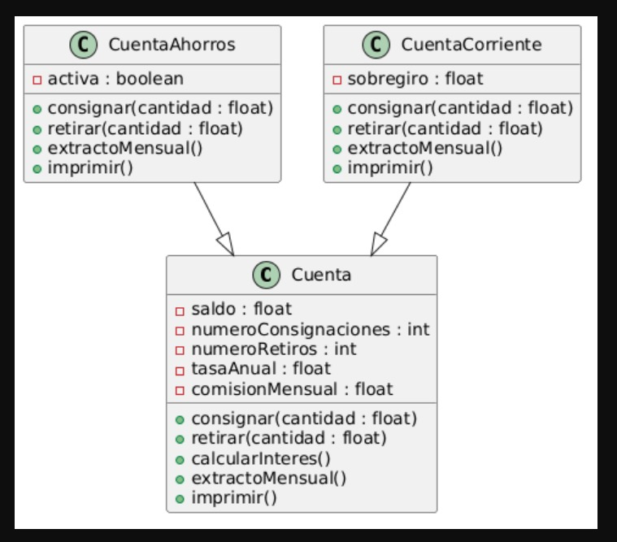

# Cuenta Bancaria

Proyecto desarrollado en **Java usando Maven** que simula un sistema de cuentas bancarias aplicando **Programación Orientada a Objetos (POO)**.

## Descripción

El sistema permite manejar diferentes tipos de cuentas bancarias.
Se pueden realizar operaciones como consignar dinero, retirar dinero y generar el extracto mensual.

## Clases del sistema

### Cuenta

Clase base que contiene la información general de una cuenta bancaria.

**Atributos**

* saldo
* numeroConsignaciones
* numeroRetiros
* tasaAnual
* comisionMensual

**Métodos**

* consignar()
* retirar()
* calcularInteres()
* extractoMensual()
* imprimir()

### CuentaAhorros

Clase que hereda de **Cuenta**.

Atributo adicional:

* activa

### CuentaCorriente

Clase que hereda de **Cuenta**.

Atributo adicional:

* sobregiro

## Diagrama UML

## Tecnologías utilizadas

* Java
* Maven
* Git y GitHub